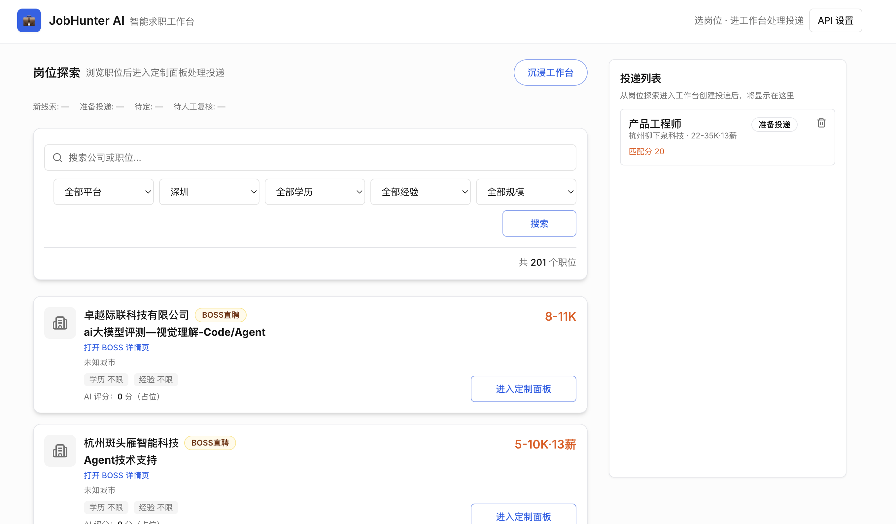
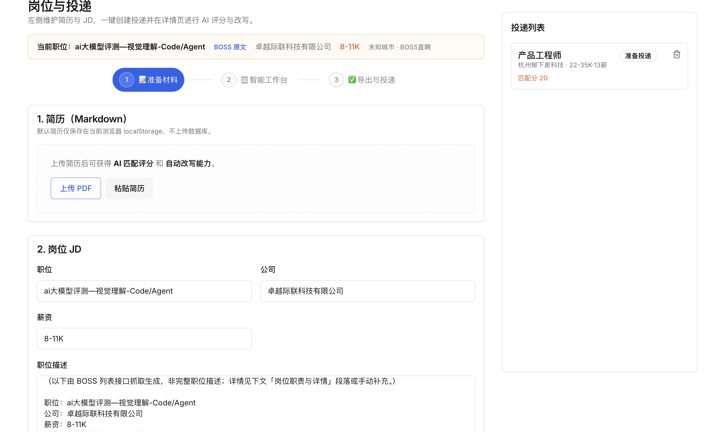
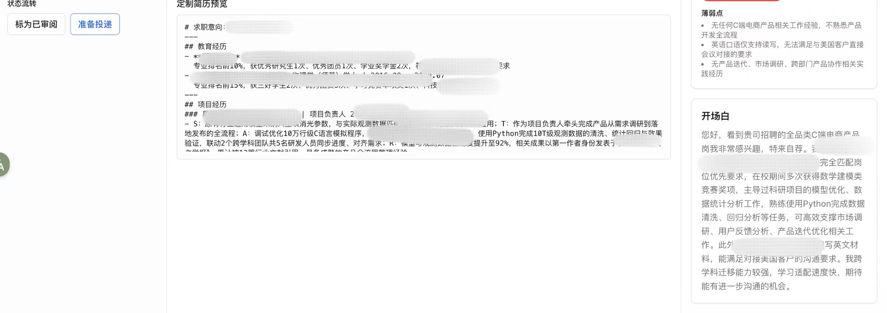
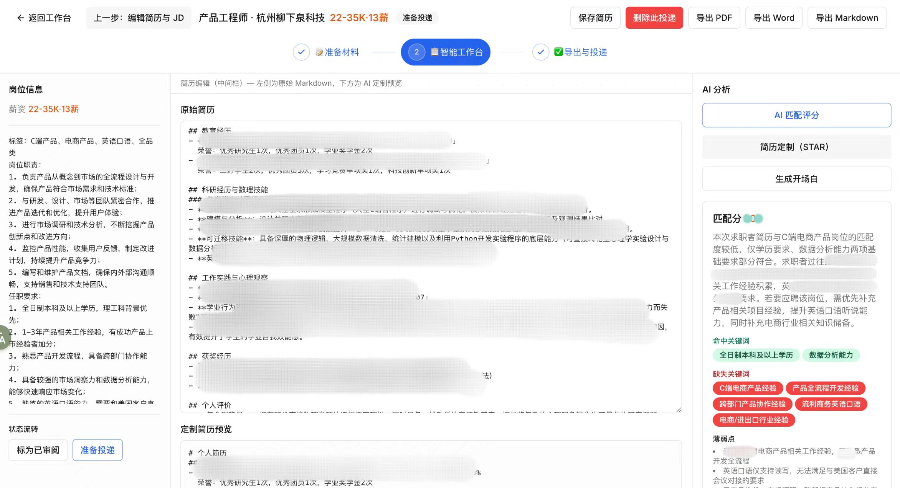

# JobHunter AI

JobHunter AI 是一个面向真实求职流程的 AI 工作台。它把「岗位信息进入系统 → 匹配判断 → 简历定制 → 开场白生成 → 导出投递材料」串成一条连续链路，减少在截图、文档、聊天窗口和表格之间反复切换。

## 这项目解决什么问题

常见求职流程里，岗位信息、原始简历、改写版本、开场白和投递状态往往分散在不同工具里。JobHunter AI 的目标不是只做一个单点生成器，而是把这些动作放进同一套工作台里，帮助用户更快完成一次完整投递。

## 核心能力

- 职位截图识别，提取结构化岗位信息
- AI 匹配评分，输出命中项、缺失项和弱项总结
- 基于目标岗位改写简历，生成结构化 Markdown
- 生成中文开场白，适配直接沟通场景
- 管理投递状态，保留岗位、简历和投递记录
- 导出 PDF、Word、Markdown

## 主流程

1. 录入岗位：支持手动填写、截图识别，或本地实验抓取
2. 进入工作台：关联岗位与原始简历
3. 运行 AI：拿到匹配分、定制简历和开场白
4. 审阅后导出：输出可投递的最终材料

## 界面预览

### 1. 岗位探索与投递入口



### 2. 准备材料：上传简历并整理岗位信息



### 3. 智能工作台：评估、润色与导出





## 技术概览

- Next.js 14
- Tailwind + shadcn/ui
- Prisma + PostgreSQL
- OpenAI 兼容 API
- Playwright / 本地爬虫（可选）

## 本地运行

1. 安装依赖

   ```bash
   npm install
   ```

2. 复制环境变量

   ```bash
   cp .env.example .env
   ```

3. 启动数据库

   ```bash
   docker compose up -d
   ```

4. 初始化数据库

   ```bash
   npm run db:push
   ```

5. 启动开发服务

   ```bash
   npm run dev
   ```

6. 如需使用网页抓取，再安装 Playwright 浏览器

   ```bash
   npx playwright install chromium
   ```

浏览器打开 [http://localhost:3000](http://localhost:3000)。

## 环境变量

复制 `.env.example` 为 `.env`，填写：

- `DATABASE_URL` — PostgreSQL 连接串
- `OPENAI_API_KEY` — OpenAI 或兼容服务的 Key
- 可选 `OPENAI_BASE_URL`
- 可选 `OPENAI_MODEL`
- `ALLOWED_AI_BASE_URLS` — 允许的 Base URL 白名单
- 可选 `JOBHUNTER_ADMIN_TOKEN` — 保护 AI 连通性测试和飞书集成接口
- 可选 `JOBHUNTER_ALLOW_LOCAL_CRAWL=1` — 非 `development` 时仍允许本地抓取
- 可选 `JOBHUNTER_CRAWL_PYTHON` — 覆盖本地爬虫使用的 Python 可执行文件路径
- 可选飞书同步层：`FEISHU_APP_ID`、`FEISHU_APP_SECRET`、`FEISHU_BITABLE_APP_TOKEN`、`FEISHU_BITABLE_TABLE_ID`、`FEISHU_BOT_WEBHOOK`

### 前端 API 设置（本地存储）

- 页面右上角支持「API 设置」弹窗，可单独填写 `API Key / Base URL / 模型`
- 配置保存在浏览器 `localStorage`，并在请求时通过请求头透传
- 后端读取顺序：请求头优先，`.env` 兜底
- 该方式适合本地单用户调试，不建议在公共终端使用

## 核心 API

| 方法 | 路径 | 说明 |
| --- | --- | --- |
| GET/POST | `/api/jobs` | 岗位列表 / 创建 |
| GET/PATCH/DELETE | `/api/jobs/[id]` | 岗位详情与更新 |
| GET/POST | `/api/resumes` | 简历列表 / 创建 |
| GET/PATCH | `/api/resumes/[id]` | 简历读写 |
| GET/POST | `/api/applications` | 投递列表 / 创建（关联 job + resume） |
| GET/PATCH/DELETE | `/api/applications/[id]` | 投递与状态 |
| POST | `/api/applications/[id]/score` | AI 匹配评分 |
| POST | `/api/applications/[id]/tailor-resume` | STAR 定制简历 JSON |
| POST | `/api/applications/[id]/cover-letter` | 开场白 |
| POST | `/api/ai/ping` | 测试当前 AI 配置连通性 |
| POST | `/api/vision/job-from-image` | 从职位截图识别并提取岗位结构化信息 |
| POST | `/api/resume-import` | 导入简历（PDF 或图片），提取为 Markdown |
| GET | `/api/applications/[id]/export/pdf` | 导出 PDF |
| GET | `/api/applications/[id]/export/docx` | 导出 Word |
| GET | `/api/applications/[id]/export/md` | 导出 Markdown |
| POST | `/api/crawler` | Playwright 抓取 `{ url, platform }` |
| POST | `/api/crawl/local` | 本机子进程跑 `crawl_boss.py`（BOSS；`platform: other` 返回 501） |
| POST | `/api/integrations/feishu/sync-application` | 同步单条投递到飞书多维表 |
| POST | `/api/integrations/feishu/sync-report` | 发送轻量报表到飞书机器人 |
| POST | `/api/integrations/feishu/notify` | 发送自定义通知到飞书机器人 |

## 状态流转（Application）

`new` →（评分）→ `scored_high` / `scored_low` → 可手动 `reviewed` → `ready_to_apply`。

## 说明

- **PDF 导出**：若存在 `resume-template/` 且机器已安装 `xelatex`，系统会优先使用 LaTeX 模板导出；抬头姓名和联系方式会尽量从简历 Markdown 顶部提取，提取不到时使用通用占位。若 LaTeX 失败则回退到 jsPDF。响应头 `X-Resume-Export-Mode` 为 `xelatex-template` 或 `jspdf-fallback`；调试时可在 URL 加 `?debug=1`，失败时返回 JSON 错误而非 PDF。
- **截图识别（Vision）**：需要在「API 设置」里选择支持图片输入的模型；不同供应商模型命名不同，若不支持会返回友好错误。
- **简历导入**：PDF 若为扫描件可能无法解析出文本，请改用图片上传（走 Vision）或先做 OCR。
- **抓取（可选）**：各平台 DOM 与登录策略变化快，且常受反爬影响；当前主流程推荐用截图识别替代。BOSS 本地实验抓取见 [tools/boss_zhipin_crawl/README.md](tools/boss_zhipin_crawl/README.md)，仅 `development` 或 `JOBHUNTER_ALLOW_LOCAL_CRAWL=1` 下可用。请自用低频并自行遵守平台条款。
- **飞书定位**：飞书仅作为同步层（看板、通知、轻报表），主数据仍以 PostgreSQL 为准。

## Resume LaTeX Export Workflow (Skill Spec)

当你需要高质量简历排版（尤其中文 PDF）时，建议使用「Markdown 作为源 + Pandoc/LaTeX 编译」流程，而不是继续深度定制 jsPDF/docx API。

触发场景：
- 需要 `导出 markdown` / `导出 md`
- 反馈 `导出 pdf 乱码`
- 需要复用现有 LaTeX 模板
- 希望在 Cursor/Claude Code 中复现同一套导出动作

标准流程：
1. 从系统导出 `resume.md`（优先使用 tailored 内容）。
2. 准备模板目录：`template.tex`（可选 `metadata.yml`）。
3. 编译 PDF：
   - `pandoc resume.md -o resume.pdf --template=template.tex --pdf-engine=xelatex`
4. 可选编译 DOCX：
   - `pandoc resume.md -o resume.docx`
5. 检查输出：中文不乱码、层级与间距稳定、列表不丢失。

中文排版规则：
- 优先 `xelatex`（或 `lualatex`）。
- 字体配置放在 `template.tex`，避免依赖临时命令行参数。
- 若缺字/乱码，切换到本机可用 CJK 字体后重编译。

## 构建
```bash
npm run build
npm start
```
