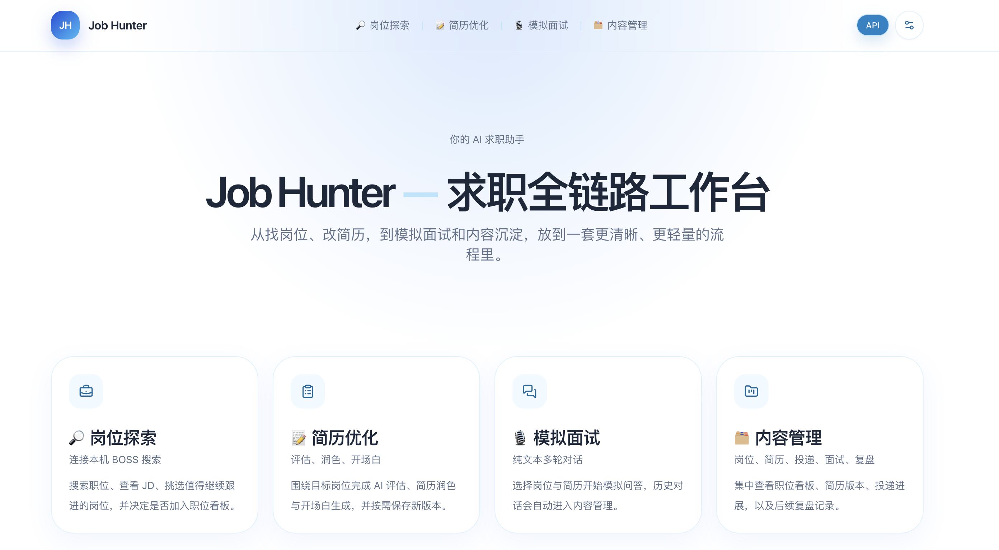
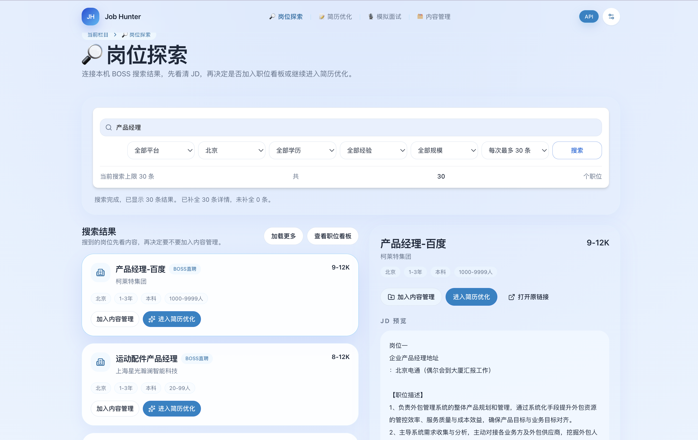
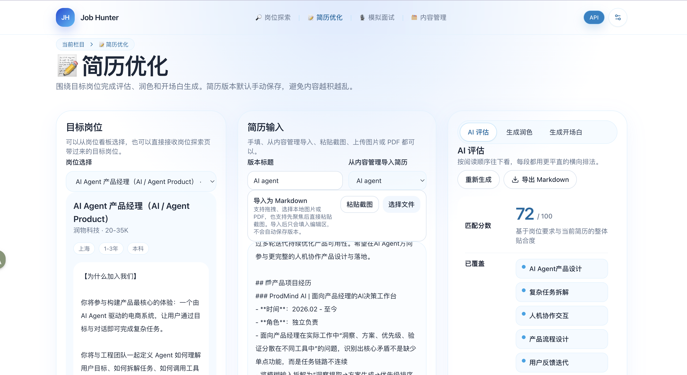
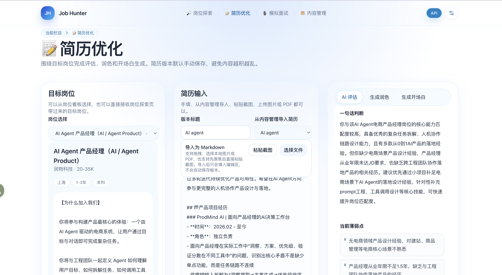
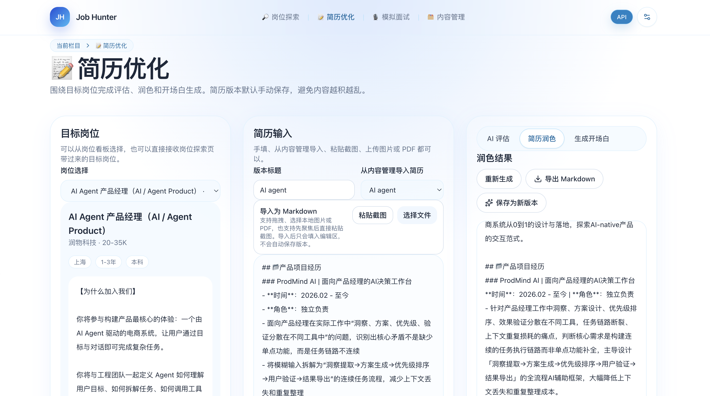
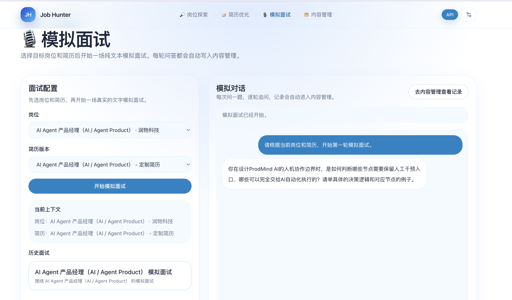
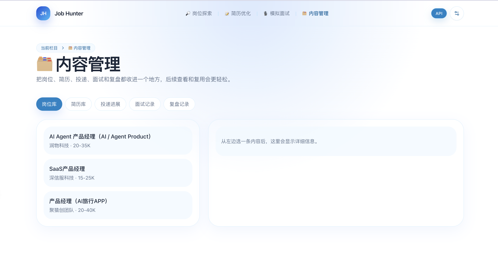

# 求职季工具安利：我做了个本地 AI 求职工作台，帮你把找岗、改简历、模拟面试串起来

---

## 正文

### 【写在前面】

最近春招、实习季一到，身边很多人的状态都很像：

- BOSS 里收藏了一堆岗位，但没有系统整理
- 看到 JD 之后，开始怀疑自己简历到底合不合适
- 改简历、写开场白、准备面试，全都散在不同工具里
- 一个岗位反复折腾半天，最后连自己投了什么都记不清

我自己在整理这类流程的时候，越来越觉得问题不在于“缺少一个会生成内容的 AI”，而在于这整条链路太容易断。

所以我做了一个本地工具，叫 **JobHunter**。  
它想解决的也不是某一个小步骤，而是尽量把下面这条路径接起来：

`找岗位 → 看 JD → 改简历 → 写开场白 → 模拟面试 → 沉淀记录`

如果你也正处在“岗位看了一堆，但流程越走越乱”的阶段，这个工具也许能帮你省点来回切换的时间。

---

### 【痛点直击】

大家有没有这种情况：

```text
┌────────────────────────────────────────────────────────────┐
│  看到一个岗位，先去招聘站里看 JD                          │
│  然后复制到文档里，开始对着旧简历一点点改                  │
│  改完又切去另一个窗口想开场白                              │
│  过两天准备面试时，发现自己连当时为什么投这个岗位都忘了    │
└────────────────────────────────────────────────────────────┘
```

说白了，求职这件事最烦的不是“不会写”，而是信息总被拆散：

| 场景 | 常见问题 |
|------|----------|
| 找岗位 | 岗位看得多，但很难持续整理 |
| 看 JD | 复制来复制去，重点信息留不住 |
| 改简历 | 每个岗位都要重改一遍，效率很低 |
| 写开场白 | 临时想，容易空泛，也容易重复 |
| 面试准备 | 岗位和简历上下文断掉，练习不够针对 |
| 后续复盘 | 投递记录、面试记录、复盘内容散在各处 |

---

### 【工具现身】

JobHunter 现在是一个 **本地工作台**，核心分成 4 个栏目：

| 栏目 | 它负责什么 |
|------|------------|
| `岗位探索` | 从本机 BOSS 搜索结果开始看岗位 |
| `简历优化` | 围绕目标岗位做评估、润色和开场白 |
| `模拟面试` | 选岗位 + 选简历，直接做文字模拟问答 |
| `内容管理` | 把岗位、简历、投递、面试、复盘统一留档 |

它更像一个“本地求职工作流工具”，不是线上 SaaS，也不是那种装完就全自动帮你投递的东西。

GitHub 地址放这里，感兴趣可以直接看：

👉 [https://github.com/wei-liping/JobHunter](https://github.com/wei-liping/JobHunter)

---

### 【图文并茂】

来几张图看看现在做到什么程度了：

**首页：先把整个流程拆开，入口更清楚**



这页主要就是导航，不再把所有东西堆在一个工作台里。

---

**岗位探索：先看岗位，再决定值不值得继续投入**



这一页会连接你本机已经登录的 BOSS，会尽量贴近原站搜索结果。  
你可以先浏览岗位，再决定：

- 要不要加入内容管理
- 要不要直接进入简历优化

---

**简历优化：先判断，再动手改**





这一块不是一上来就硬写简历，而是先看：

- 匹配分数
- 已覆盖的点
- 缺失点
- 当前薄弱点
- 可以补什么短项目

先判断，再改写，效率会比盲改高很多。

---

**简历润色：围绕目标岗位，改成更能投的版本**



简历内容现在支持：

- 直接手动粘贴
- 从历史版本里选
- 粘贴截图
- 上传图片 / PDF，再识别成可编辑内容

最后主要导出成 Markdown，也可以另存成新的简历版本。

---

**模拟面试：别只写材料，也练一练真实问答**



这里会基于你选中的岗位和简历做文字模拟。  
不是随便闲聊，而是围绕具体岗位来问，这样准备起来更有针对性。

---

**内容管理：把前面所有动作真正留住**



最后这些内容不会散掉，而是统一进内容管理里：

- 岗位库
- 简历库
- 投递进展
- 面试记录
- 复盘记录

---

### 【核心亮点】

#### 1. 它不是单点生成器，而是一条连续链路

很多工具都能帮你“生成一点内容”，但求职最麻烦的地方其实是流程切换。  
JobHunter 现在最想解决的，就是把这条链路接住。

#### 2. 岗位探索更接近真实行为

它不是先让你手动录一堆岗位信息，而是直接从你本机浏览器里的 BOSS 搜索开始。  
这样入口更自然，也更符合真实找岗习惯。

#### 3. 简历优化不是只会润色

这一块除了改简历，还会先帮你看：

- 目前匹配到什么程度
- 缺什么点
- 哪些地方是短板
- 如果缺经历，可以补什么 1 到 3 天能做完的小项目

#### 4. 面试和内容沉淀也在同一套系统里

这点我自己觉得挺重要。  
很多时候大家会花很多时间改材料，但面试准备和后续复盘又跑到别的地方去了。现在这两块也能接上。

---

### 【适合谁用 / 怎么用】

这套东西更适合下面这种使用方式：

- 你已经在本机浏览器里登录招聘网站
- 你想先快速搜一批岗位，再决定跟进哪些
- 你希望针对一个岗位生成更贴近目标的简历版本
- 你想把投递、面试和复盘都留在一个地方

一个比较顺手的用法大概是：

1. 先在 `岗位探索` 里搜岗位  
2. 选一个比较想投的岗位，直接进入 `简历优化`  
3. 看评估结果，再改简历、写开场白  
4. 用同一个岗位和简历做 `模拟面试`  
5. 最后把岗位和简历版本留在 `内容管理` 里

---

### 【Q&A】

#### Q1：这东西能直接在线用吗？

目前更适合 **本地运行**。  
也就是说，你需要把项目拉下来，在自己电脑上跑。

#### Q2：岗位探索是怎么搜到岗位的？

岗位探索会连你本机已经登录的 BOSS 浏览器会话，所以入口更接近真实找岗流程。  
但它不是官网本身，结果会尽量贴近原站，不是每次都和官网完全一模一样。

#### Q3：需要自己配模型吗？

需要。  
右上角直接填 `API Key / Base URL / 模型名` 就行，适合自己本地用。

#### Q4：简历和岗位内容存在哪里？

岗位、简历、投递记录、面试记录这些内容会放在你本地数据库里。  
右上角那组模型配置则存在你当前浏览器里。

#### Q5：它适合什么人？

比较适合：

- 最近在找实习、春招、秋招的人
- 想把岗位、简历、面试准备收口到一个地方的人
- 不想每看一个岗位就重新复制一遍 JD、重新开一堆文档的人

---

### 【结尾】

如果你最近也在找实习、找工作，或者刚好也觉得“岗位、简历、面试准备全散着”很烦，这套思路也许能帮到你。

我现在还在继续打磨这条流程，尤其是：

- 岗位搜索结果和原站的贴合度
- 简历润色的自然程度
- 面试反馈和复盘的实用性

如果大家愿意的话，我后面也可以再整理一版：

- 更适合产品岗的使用方式
- 更适合技术岗的简历优化玩法
- 或者直接分享一下这套工作流到底怎么用最省时间

如果你看完有兴趣，或者你自己在用的时候踩到了什么坑，也欢迎交流一下使用体验。  
如果大家觉得这条路子有用，我后面也可以继续把它打磨得更顺一点。
